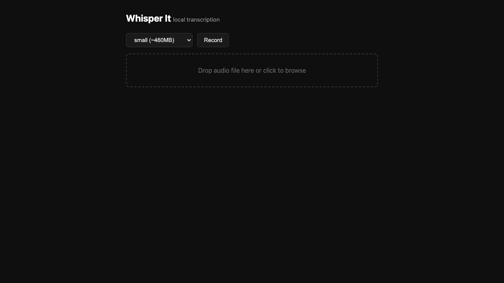
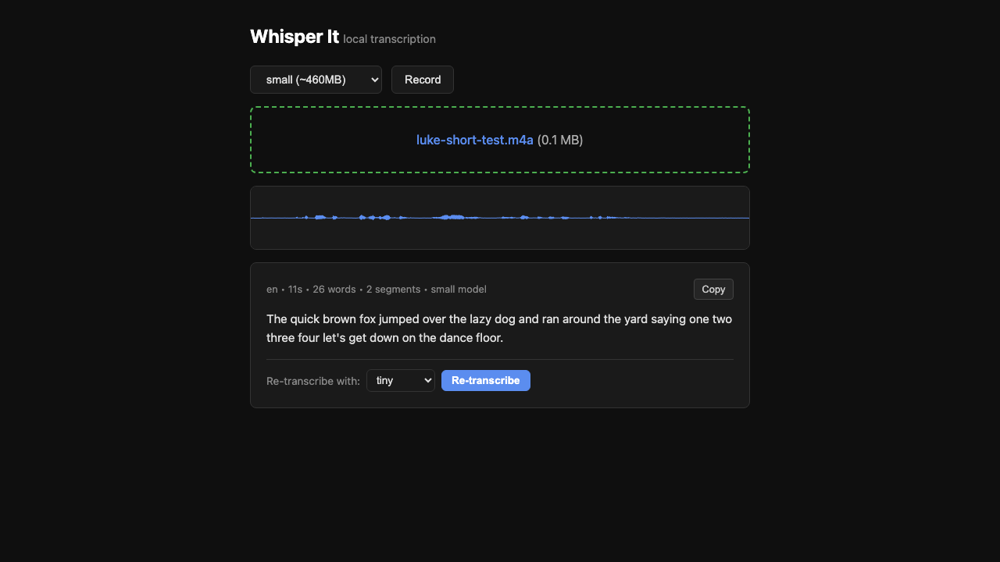

# Whisper It

A self-hosted audio transcription web app powered by [faster-whisper](https://github.com/SYSTRAN/faster-whisper). Record from your mic or upload an audio file, get text back. No API keys, no tokens, no accounts, no cloud dependency. Runs entirely on your own hardware in a single Docker container.

## Why I Built This

I kept getting frustrated with cloud-based voice transcription. AI assistants butcher voice notes. Commercial transcription APIs need keys and charge per request. And when I'm on the go and just want to quickly transcribe something from my phone, I don't want to deal with any of that.

OpenAI's Whisper model produces significantly better transcriptions, but using it normally means setting up Python environments, managing dependencies, or paying for API access.

Whisper It wraps all of that into a simple web app: open it in your browser, record or upload, and get your text. It costs nothing to run, your audio never leaves your network, and there's zero setup beyond `docker compose up`.

## Screenshots

| Start | After transcription |
|-------|-------------------|
|  |  |

## Features

- **Record or upload** -- Record directly from your mic (with a live audio level visualizer and timer) or drag-and-drop / browse for an audio file.
- **Multi-file batch upload** -- Drop or pick multiple files at once. They're queued and transcribed sequentially, with a live status list (pending / active / done / failed). Each result is titled by its source filename.
- **Recordings auto-titled with date stamp** -- Mic recordings are saved as `Recording YYYY-MM-DD HH-MM-SS` and tagged with a Recording badge so you can tell them apart from uploaded files.
- **Batch indicator** -- Items uploaded together share a `Batch · N of M` badge for easy grouping.
- **Auto-transcribe** -- Transcription starts immediately when you finish recording or select files. No extra clicks.
- **Multiple Whisper models** -- Choose from tiny (~75 MB), base (~140 MB), small (~460 MB), medium (~1.5 GB), or large-v3 (~3 GB). Default is small, which balances speed and accuracy well on CPU.
- **Language selector** -- Force a specific language (English, Spanish, French, etc.) or leave on Auto-detect. Whisper sometimes hallucinates a wrong language during silent stretches; forcing one fixes that. Persists in localStorage.
- **Long-audio chunking** -- Files longer than 20 minutes are auto-split via ffmpeg into 10-minute mono 16 kHz WAV chunks, transcribed sequentially with VAD silence-trim, and stitched back with original timestamps. Keeps memory bounded regardless of file length.
- **Live ETA + tab-title progress** -- Long transcriptions show per-chunk progress and a refining ETA inside the queue panel; the browser tab title updates to `[N/total] · ETA` so you can leave the tab and check back.
- **Re-transcribe** -- Not happy with the result? Pick a different model (or different language) and re-transcribe the same audio without re-uploading.
- **Download progress** -- First use of a model downloads it automatically. A live progress bar shows the download percentage.
- **Waveform display** -- See an Audacity-style waveform rendering of your audio.
- **Word count** -- Results show language, duration, word count, segment count, and which model was used.
- **Save transcript as file** -- Download any transcript as a `.txt` file, named after the source filename.
- **Save batch as zip** -- For multi-file uploads, click the batch badge (or the per-item *Zip batch* button) to download every transcript in the batch as a single zip — one `.txt` per audio file, named after the originals.
- **Persistent stats page** -- A `/stats.html` dashboard shows total transcriptions, audio duration processed, words produced, model and language breakdowns, last-30-days activity chart, longest item, and recent activity. Stats persist across container restarts via a Docker volume.
- **Share** -- Uses the OS-level share sheet (WhatsApp, Telegram, Messages, AirDrop, email, etc.) on supported browsers. Falls back to clipboard copy.
- **Microphone selector** -- When multiple mics are detected, pick the right one from a row of buttons. Your choice is remembered across sessions.
- **Transcription history** -- Every transcription is saved to your browser's `localStorage` (never a server, never a database). On return visits you see your previous transcriptions, with the most recent highlighted at the top. Each entry shows title, date, language, duration, word count, and model used. Copy, download, share, zip, or delete individual entries, or clear them all. Nothing leaves your device.
- **Audio auto-deleted on the server** -- Uploaded audio files are removed immediately after transcription completes (or on disconnect / error). Nothing is retained server-side except the aggregate stats.
- **Version & GitHub footer** -- Footer shows the current build version (last 4 chars of the commit hash, links to the exact GitHub commit).
- **Mobile-friendly** -- Works on your phone's browser. Record a voice memo and get text in seconds.

## Quick Start

Pull and run the prebuilt image from Docker Hub — no clone, no build. Multi-arch image supports `linux/amd64` and `linux/arm64` (Apple Silicon, Raspberry Pi 4/5, AWS Graviton).

```bash
docker run -d -p 4000:4000 -v whisper-models:/models \
  --restart unless-stopped --name whisper-it \
  lukevenediger/whisper-it:latest
```

Or with a `docker-compose.yml`:

```yaml
services:
  whisper-it:
    image: lukevenediger/whisper-it:latest
    ports: ["4000:4000"]
    volumes:
      - whisper-models:/models   # cached model weights
      - whisper-data:/data       # persistent stats
    mem_limit: 4g
    restart: unless-stopped
volumes:
  whisper-models:
  whisper-data:
```

Open http://localhost:4000 in your browser.

The first transcription with a given model will be slower because it downloads the model weights (~75 MB to ~3 GB depending on model size). Weights are cached in the `whisper-models` volume and reused across restarts.

### Run from source

```bash
git clone https://github.com/lukevenediger/whisper-it.git
cd whisper-it
make run        # builds + starts in detached mode, injects current commit hash for footer
# or: docker compose up --build  (footer version will show "dev")
```

`make run` runs `COMMIT_HASH=$(git rev-parse HEAD) docker compose up --build -d` so the footer's version label resolves to a clickable link to the exact GitHub commit. Plain `docker compose up --build` works fine but the footer falls back to `dev`.

## Deployment

Whisper It has **no built-in authentication**. It's designed for anonymous access within a trusted network.

### On a VPN (Recommended)

Run it on any machine in your Tailscale, WireGuard, or other VPN network. Anyone on the VPN can open it in their browser and transcribe. This is the intended deployment model: zero friction, trusted network.

```bash
# On your server / NAS / spare machine
docker compose up -d --build

# Access from any device on the VPN
# http://your-machine:4000
```

### Behind Cloudflare Tunnel

If you want to expose it to the internet with access control:

1. Set up a [Cloudflare Tunnel](https://developers.cloudflare.com/cloudflare-one/connections/connect-networks/) pointing to `localhost:4000`
2. Add a [Cloudflare Access](https://developers.cloudflare.com/cloudflare-one/policies/access/) policy to gate on email, SSO, or one-time PIN

This gives you authentication without modifying the app.

### Local Only

Just run it on your laptop for personal use:

```bash
docker compose up --build
# Open http://localhost:4000
```

**Do not** expose Whisper It directly to the public internet without an auth layer in front of it.

## How It Works

```
Browser  -->  Express (port 4000)  -->  python3 transcribe.py  -->  SSE stream
                 |
          Static HTML/JS/CSS
```

1. The frontend is a single HTML file (plus a separate `stats.html`) with all CSS and JavaScript inline. No build step, no framework.
2. When you upload or record audio, it POSTs to `/api/transcribe` on the Express server.
3. Express spawns a Python child process running faster-whisper.
4. Progress (model download %, loading, transcribing) is streamed back to the browser via Server-Sent Events (SSE).
5. The final transcription result is sent as the last SSE event.
6. Express deletes the uploaded audio from disk immediately after transcription (or if the client disconnects).
7. A small stats record (model, language, duration, words, timestamp, recording-vs-upload) is appended to `/data/stats.json` and exposed via `/api/stats`.

Everything runs in a single Docker container: Node.js serves the frontend and API, Python handles transcription. Two named volumes are used: `whisper-models` for cached model weights, and `whisper-data` for persistent stats. Both survive container restarts and rebuilds.

Transcription history lives in your browser's `localStorage` (capped at 100 entries) — independent of the server-side stats. The server only retains the aggregate stats; original audio is never kept. Clear your browser data to wipe history; remove the `whisper-data` volume to wipe server stats.

## Whisper Models

| Model | Size | Speed | Accuracy | Best For |
|-------|------|-------|----------|----------|
| tiny | ~75 MB | Fastest | Lower | Quick drafts, short clips |
| base | ~140 MB | Fast | Moderate | General use when speed matters |
| **small** | ~460 MB | Moderate | **Good** | **Default. Best balance for CPU.** |
| medium | ~1.5 GB | Slower | Better | When accuracy matters more than speed |
| large-v3 | ~3 GB | Slowest | Best | Maximum accuracy, long or complex audio |

All models run on CPU using int8 quantization via CTranslate2 for lower memory usage and faster inference.

## API

If you want to integrate with Whisper It programmatically:

### POST /api/transcribe

**Request:**
```
Content-Type: multipart/form-data
Fields:
  audio:         (file,   required) -- any audio format supported by ffmpeg
  model:         (string, optional) -- "tiny", "base", "small", "medium", or "large-v3". Default: "small"
  language:      (string, optional) -- ISO 639-1 code ("en", "es", "fr", ...) or "auto" (default).
  filename:      (string, optional) -- original filename for stats / display
  fromRecording: (string, optional) -- "true" if recorded in-browser, else "false"
```

**Response:** Server-Sent Events stream

```
data: {"status":"loading_model"}
data: {"status":"downloading","progress":45.2,"total":483000000}
data: {"status":"chunking","duration":3720.5}                   # only on long audio
data: {"status":"chunked","total":7,"chunk_seconds":600}        # only on long audio
data: {"status":"transcribing"}                                 # short audio (single-pass)
data: {"status":"transcribing","chunk":3,"total":7}             # long audio (per-chunk)
data: {"status":"result","text":"...","segments":[{"start":0,"end":5.2,"text":"..."}],"language":"en","duration":10.5}
```

On failure, the final event is `{"status":"error","error":"..."}` with a human-readable cause (including OOM detection — process killed by `SIGKILL` is reported as a likely out-of-memory event with model name).

**Max file size:** 100 MB. The audio file is deleted from server disk immediately after the request completes.

### GET /api/stats

Returns the aggregate stats JSON used by the stats page:

```json
{
  "total": 42,
  "totalDurationSec": 4720.5,
  "totalWords": 12338,
  "totalAudioBytes": 184320000,
  "byModel": { "small": { "count": 30, "durationSec": 3100 }, ... },
  "byLanguage": { "en": 38, "fr": 4 },
  "byDay": { "2026-04-29": 7, ... },
  "recordingCount": 12,
  "uploadCount": 30,
  "firstAt": 1714080000000,
  "lastAt": 1714400000000,
  "longestDurationSec": 1820.0,
  "longest": { "ts": ..., "model": "...", "filename": "...", ... },
  "recent": [ /* last 50 events */ ]
}
```

### POST /api/zip

Bundle a list of transcripts into a downloadable zip.

**Request:**
```json
{
  "files": [
    { "name": "interview-01.txt", "text": "..." },
    { "name": "interview-02.txt", "text": "..." }
  ],
  "zipName": "transcripts-2026-04-29.zip"
}
```

**Response:** `application/zip` attachment.

### GET /api/version

Returns the build's commit hash, short label, and a direct link to the commit on GitHub:

```json
{
  "commit": "d47e8cafee08921c0999d2d85b0467170810f1f2",
  "short": "f1f2",
  "isReal": true,
  "commitUrl": "https://github.com/lukevenediger/whisper-it/commit/d47e8cafee08921c0999d2d85b0467170810f1f2",
  "github": "https://github.com/lukevenediger/whisper-it",
  "x": "https://x.com/jumpdest7d",
  "xHandle": "@jumpdest7d"
}
```

`short` is the last 4 chars of the commit hash (or `"dev"` if the build wasn't given `COMMIT_HASH`). The footer of every page renders this as `v·xxxx` linking to the exact commit.

## Tuning & Environment Variables

| Variable               | Default                          | Purpose                                                                                                  |
|------------------------|----------------------------------|----------------------------------------------------------------------------------------------------------|
| `PORT`                 | `4000`                           | HTTP port the Express server listens on.                                                                 |
| `WHISPER_MODELS_DIR`   | `/models`                        | Where faster-whisper caches downloaded model weights.                                                    |
| `WHISPER_DATA_DIR`     | `/data`                          | Where the server persists `stats.json`.                                                                  |
| `WHISPER_COMMIT`       | `dev`                            | Build-time commit hash, baked via `--build-arg COMMIT_HASH=…`. Drives `/api/version` and the footer.     |
| `WHISPER_CPU_THREADS`  | `2`                              | CPU threads passed to `faster_whisper.WhisperModel`. Higher = faster but more memory.                     |
| `WHISPER_NUM_WORKERS`  | `1`                              | ctranslate2 worker count. Each worker = one set of scratch buffers.                                       |
| `WHISPER_BEAM_SIZE`    | `5`                              | Decoder beam size. Lower (e.g. `1`) cuts memory & latency at small accuracy cost.                         |
| `WHISPER_CHUNK_THRESHOLD_SEC` | `1200`                    | Audio longer than this triggers ffmpeg pre-chunking (default 20 minutes).                                  |
| `WHISPER_CHUNK_SECONDS`| `600`                            | Length of each chunk when chunking kicks in (default 10 minutes).                                          |
| `OMP_NUM_THREADS`      | `2`                              | OpenMP thread cap. Mirrors `WHISPER_CPU_THREADS`.                                                         |
| `MKL_NUM_THREADS`      | `2`                              | MKL/BLAS thread cap.                                                                                      |
| `OPENBLAS_NUM_THREADS` | `2`                              | OpenBLAS thread cap.                                                                                      |

### Memory & OOM

faster-whisper (via CTranslate2) allocates per-thread scratch buffers. With many CPU cores, peak memory can balloon far beyond the model size. The defaults above cap thread fan-out and keep `base`/`small` comfortably under ~400 MB peak. For `medium`/`large-v3` or very long audio:

- Bump `mem_limit` in `docker-compose.yml` (default: `8g`).
- Make sure your Docker Desktop VM has enough RAM in **Settings → Resources → Memory** (≥6 GB recommended for `medium`, ≥8 GB for `large-v3`).
- If you see `Transcription failed: Process killed (likely out of memory ...)` in the UI, that's exactly this: pick a smaller model or grant more RAM.

### Long Audio

Audio longer than 20 minutes is automatically pre-split into 10-minute chunks via ffmpeg (mono, 16 kHz, PCM) before being fed to faster-whisper. Each chunk is transcribed independently with VAD silence-trim and `condition_on_previous_text=False`; segment timestamps are offset back to the original timeline. Memory stays bounded per chunk, so a 2-hour file uses no more RAM than a 10-minute one. Tunables: `WHISPER_CHUNK_THRESHOLD_SEC`, `WHISPER_CHUNK_SECONDS`.

### Cleanup

- Audio uploads land in `/tmp/whisper-uploads/` and are deleted immediately after each request finishes (or on client disconnect / error).
- Long-audio chunks land in `/tmp/whisper-chunks-XXXXXX/` and are removed after the run; if Python is killed mid-run, the SIGTERM/SIGINT handler still removes them.
- On server startup, both directories are swept clean of any orphans left from a forced restart.

## Development

To run without Docker (requires Node 20+ and Python 3.10+):

```bash
npm install
pip install faster-whisper
WHISPER_MODELS_DIR=./models WHISPER_DATA_DIR=./data npm run dev
```

### Make targets

```
make run         # build + start container in background (injects commit hash for footer)
make build       # build image only
make stop        # docker compose down
make restart     # stop + run
make logs        # tail container logs
make typecheck   # npx tsc --noEmit
make dev         # run server locally without Docker
make clean       # nuke containers, image, model + data volumes
```

## Releasing

Publishing to Docker Hub is automated via `.github/workflows/publish.yml`:

- **Push to `main`** → publishes `lukevenediger/whisper-it:latest` and `:main-<short-sha>`.
- **Git tag `vX.Y.Z`** → publishes `:X.Y.Z`, `:X.Y`, `:X`, and updates `:latest`.

Cut a release:

```bash
git tag v1.2.3
git push --tags
```

Required GitHub Actions secrets: `DOCKERHUB_USERNAME`, `DOCKERHUB_TOKEN` (Docker Hub access token with Read/Write/Delete on `lukevenediger/whisper-it`).

## Project Structure

```
whisper-it/
├── docker-compose.yml       # Single service, port 4000, model + data volumes, mem_limit
├── Dockerfile               # node:20-slim + Python 3 + faster-whisper, thread caps baked in
├── Makefile                 # make run / build / logs / clean shortcuts (injects commit hash)
├── package.json             # Express, multer, archiver, TypeScript
├── tsconfig.json
├── transcribe.py            # Python: faster-whisper with progress reporting + tunable threads
└── src/
    ├── server.ts            # Express: /api/transcribe (SSE), /api/stats, /api/zip, /api/version
    ├── stats.ts             # Persistent stats store (JSON file, atomic writes)
    └── public/
        ├── index.html       # Main UI (record / batch upload / history / footer)
        └── stats.html       # Stats dashboard
```

## Requirements

- Docker and Docker Compose
- ~512 MB RAM minimum (tiny / base), ~2 GB recommended (small), ~4 GB (medium), ~6 GB (large-v3) — assuming default CPU thread caps
- Audio input device (for recording -- uploading works without one)

## Links

- GitHub: <https://github.com/lukevenediger/whisper-it>
- Author: [@jumpdest7d](https://x.com/jumpdest7d)

## License

MIT
