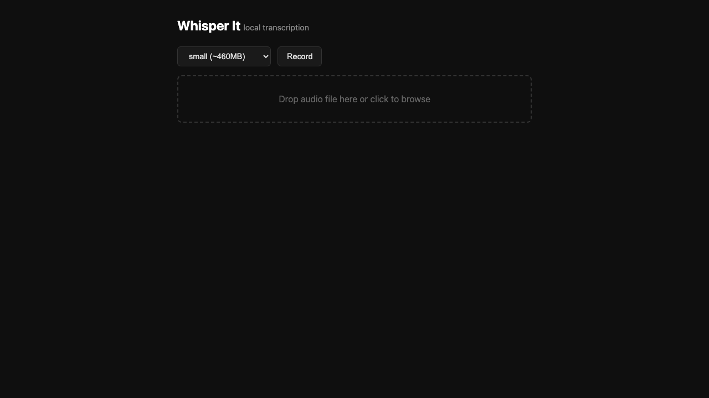
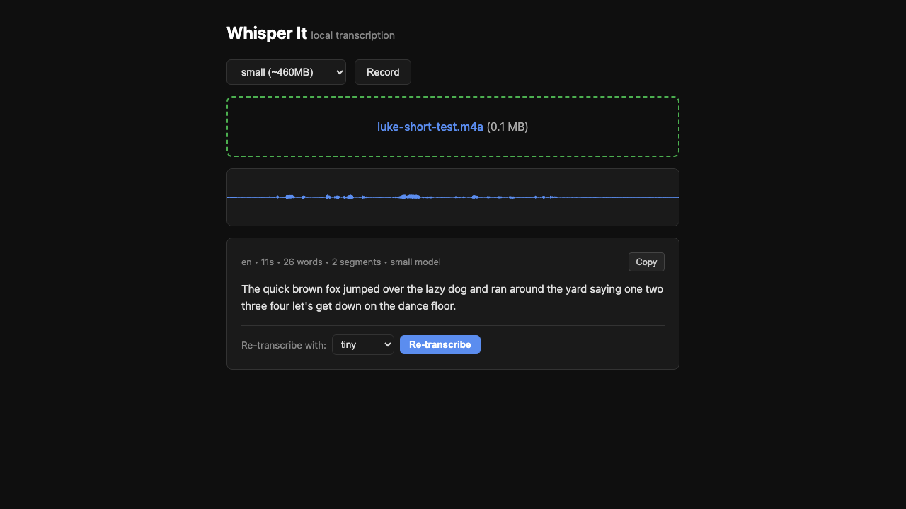

# Whisper It

A self-hosted audio transcription web app powered by [faster-whisper](https://github.com/SYSTRAN/faster-whisper). Record from your mic or upload an audio file, get text back. No API keys, no tokens, no accounts, no cloud dependency. Runs entirely on your own hardware in a single Docker container.

## Why I Built This

I kept getting frustrated with cloud-based voice transcription. AI assistants butcher voice notes. Commercial transcription APIs need keys and charge per request. And when I'm on the go and just want to quickly transcribe something from my phone, I don't want to deal with any of that.

OpenAI's Whisper model produces significantly better transcriptions, but using it normally means setting up Python environments, managing dependencies, or paying for API access.

Whisper It wraps all of that into a simple web app: open it in your browser, record or upload, and get your text. It costs nothing to run, your audio never leaves your network, and there's zero setup beyond `docker compose up`.

## Screenshots

| Start                                      | After transcription                                      |
| ------------------------------------------ | -------------------------------------------------------- |
|  |  |

## Features

- **Record or upload** -- Record directly from your mic (with a live audio level visualizer and timer) or drag-and-drop / browse for an audio file.
- **Multi-file batch upload** -- Drop or pick multiple files at once. They're queued and transcribed sequentially, with a live status list (pending / active / done / failed). Each result is titled by its source filename.
- **Recordings auto-titled with date stamp** -- Mic recordings are saved as `Recording YYYY-MM-DD HH-MM-SS` and tagged with a Recording badge so you can tell them apart from uploaded files.
- **Batch indicator** -- Items uploaded together share a `Batch · N of M` badge for easy grouping.
- **Auto-transcribe** -- Transcription starts immediately when you finish recording or select files. No extra clicks.
- **Whisper models + Parakeet v3** -- Default is Whisper **small** (~460 MB), a solid speed/accuracy balance on CPU. Also pick tiny (~75 MB), base (~140 MB), medium (~1.5 GB), large-v3 (~3 GB), or **Parakeet v3** (`parakeet-tdt-0.6b-v3`, ~670 MB) — NVIDIA's multilingual model run on-device via [onnx-asr](https://github.com/istupakov/onnx-asr), the same model the [Handy](https://github.com/cjpais/Handy) app uses (25 European languages, fast on CPU). No API keys, no HuggingFace login. **Your model choice is remembered across reloads.**
- **Language selector** -- Force a specific language or leave on Auto-detect. Parakeet auto-detects across its 25 supported European languages; if you force a language Parakeet can't do (e.g. Japanese, Chinese, Arabic), the request transparently **falls back to a Whisper model** and a notice tells you so. Persists in localStorage.
- **Long-audio chunking** -- Files longer than 20 minutes are auto-split via ffmpeg into 10-minute mono 16 kHz WAV chunks, transcribed sequentially with VAD silence-trim, and stitched back with original timestamps. Keeps memory bounded regardless of file length.
- **Live ETA + tab-title progress** -- Long transcriptions show per-chunk progress and a refining ETA inside the queue panel; the browser tab title updates to `[N/total] · ETA` so you can leave the tab and check back.
- **Re-transcribe** -- Not happy with the result? Pick a different model (or different language) and re-transcribe the same audio without re-uploading.
- **Download progress** -- First use of a model downloads it automatically. A live progress bar shows the download percentage.
- **Waveform display** -- See an Audacity-style waveform rendering of your audio.
- **Word count** -- Results show language, duration, word count, segment count, and which model was used.
- **Save transcript as file** -- Download any transcript as a `.txt` file, named after the source filename.
- **Save batch as zip** -- For multi-file uploads, click the batch badge (or the per-item _Zip batch_ button) to download every transcript in the batch as a single zip — one `.txt` per audio file, named after the originals.
- **Speaker attribution (opt-in)** -- Click _Attribute_ on any transcription to open a modal. Optionally list the speakers (name + short role description) and pick a model from the dropdown. Whisper It calls an LLM via OpenRouter and assigns a named speaker to every segment. Leave the roster blank and the model guesses how many speakers there are and labels them `Speaker 1`, `Speaker 2`, …; fill it in and the model is locked to those names. Ambiguous segments get a `?` chip + a yellow highlight, with a short note from the model on how it resolved hard cases. Save promotes the result to a new sibling history entry — the original is never overwritten. Server-side `OPENROUTER_API_KEY` only — no per-user key entry. Never inline with the basic transcribe flow.
- **WhatsApp transcription** -- Connect a WhatsApp number (via the bundled [WAHA](https://waha.devlike.pro) container) and send or forward it voice notes — the bot replies with the transcription, using the same pipeline as the web app. A UI-editable, deny-by-default number **whitelist** controls access; everyone else is silently ignored. Reply `diarize` (or `diarize Alice, Bob`) to get a speaker-labelled version. The `/whatsapp.html` admin page shows the pairing QR + connection status, the whitelist, transcription defaults, and per-sender usage stats. See [WhatsApp Transcription](#whatsapp-transcription) below.
- **Telegram transcription** -- Create a bot with @BotFather, drop its token in `.env`, and send it voice notes, audio files or forwards — it replies with the transcript. Each reply carries **Retry** (pick another model), **Language** (force a language and re-run) and **Diarize** (guess speakers or type their names) buttons, mirroring the web features; `/model` and `/language` set your personal defaults. Short transcripts come back as a message, long ones as a **PDF**. Deny-by-default **whitelist** of Telegram user IDs; the `/telegram.html` admin page manages it plus defaults and usage. Long polling — no public URL needed. See [Telegram Transcription](#telegram-transcription) below.
- **Persistent stats page** -- A `/stats.html` dashboard shows total transcriptions, audio duration processed, words produced, model and language breakdowns, last-30-days activity chart, longest item, and recent activity. Stats persist across container restarts via a Docker volume.
- **Share** -- Uses the OS-level share sheet (WhatsApp, Telegram, Messages, AirDrop, email, etc.) on supported browsers. Falls back to clipboard copy.
- **Microphone selector** -- When multiple mics are detected, pick the right one from a row of buttons. Your choice is remembered across sessions.
- **Transcription history** -- Every transcription is saved to your browser's `localStorage` (never a server, never a database). On return visits you see your previous transcriptions, with the most recent highlighted at the top. Each entry shows title, date, language, duration, word count, and model used. Copy, download, share, zip, or delete individual entries, or clear them all. Nothing leaves your device.
- **Audio auto-deleted on the server** -- Uploaded audio files are removed immediately after transcription completes (or on disconnect / error). Nothing is retained server-side except the aggregate stats.
- **Version & GitHub footer** -- Footer shows the current build version (last 4 chars of the commit hash, links to the exact GitHub commit).
- **Mobile-friendly** -- Works on your phone's browser. Record a voice memo and get text in seconds.

## Quick Start

Pull and run the prebuilt image from Docker Hub — no clone, no build. Multi-arch image supports `linux/amd64` and `linux/arm64` (Apple Silicon, Raspberry Pi 4/5, AWS Graviton).

```bash
docker run -d -p 4000:4000 -v whisper-models:/models \
  --restart unless-stopped --name whisper-it \
  lukevenediger/whisper-it:latest
```

Or with a `docker-compose.yml`:

```yaml
services:
  whisper-it:
    image: lukevenediger/whisper-it:latest
    ports: ["4000:4000"]
    volumes:
      - whisper-models:/models # cached model weights
      - whisper-data:/data # persistent stats
    mem_limit: 4g
    restart: unless-stopped
volumes:
  whisper-models:
  whisper-data:
```

Open http://localhost:4000 in your browser.

The first transcription with a given model will be slower because it downloads the model weights (~75 MB to ~3 GB depending on model size). Weights are cached in the `whisper-models` volume and reused across restarts.

### Run from source

```bash
git clone https://github.com/lukevenediger/whisper-it.git
cd whisper-it
make run        # builds + starts in detached mode, injects current commit hash for footer
# or: docker compose up --build  (footer version will show "dev")
```

`make run` runs `COMMIT_HASH=$(git rev-parse HEAD) docker compose up --build -d` so the footer's version label resolves to a clickable link to the exact GitHub commit. Plain `docker compose up --build` works fine but the footer falls back to `dev`.

## Deployment

Whisper It has **no built-in authentication**. It's designed for anonymous access within a trusted network.

### On a VPN (Recommended)

Run it on any machine in your Tailscale, WireGuard, or other VPN network. Anyone on the VPN can open it in their browser and transcribe. This is the intended deployment model: zero friction, trusted network.

```bash
# On your server / NAS / spare machine
docker compose up -d --build

# Access from any device on the VPN
# http://your-machine:4000
```

### Behind Cloudflare Tunnel

If you want to expose it to the internet with access control:

1. Set up a [Cloudflare Tunnel](https://developers.cloudflare.com/cloudflare-one/connections/connect-networks/) pointing to `localhost:4000`
2. Add a [Cloudflare Access](https://developers.cloudflare.com/cloudflare-one/policies/access/) policy to gate on email, SSO, or one-time PIN

This gives you authentication without modifying the app.

### Local Only

Just run it on your laptop for personal use:

```bash
docker compose up --build
# Open http://localhost:4000
```

**Do not** expose Whisper It directly to the public internet without an auth layer in front of it.

## How It Works

```
Browser  -->  Express (port 4000)  -->  python3 transcribe.py  -->  SSE stream
                 |
          Static HTML/JS/CSS
```

1. The frontend is a single HTML file (plus a separate `stats.html`) with all CSS and JavaScript inline. No build step, no framework.
2. When you upload or record audio, it POSTs to `/api/transcribe` on the Express server.
3. Express spawns a Python child process running faster-whisper.
4. Progress (model download %, loading, transcribing) is streamed back to the browser via Server-Sent Events (SSE).
5. The final transcription result is sent as the last SSE event.
6. Express deletes the uploaded audio from disk immediately after transcription (or if the client disconnects).
7. A small stats record (model, language, duration, words, timestamp, recording-vs-upload) is appended to `/data/stats.json` and exposed via `/api/stats`.

Everything runs in a single Docker container: Node.js serves the frontend and API, Python handles transcription. Two named volumes are used: `whisper-models` for cached model weights, and `whisper-data` for persistent stats. Both survive container restarts and rebuilds.

Transcription history lives in your browser's `localStorage` (capped at 100 entries) — independent of the server-side stats. The server only retains the aggregate stats; original audio is never kept. Clear your browser data to wipe history; remove the `whisper-data` volume to wipe server stats.

## Whisper Models

| Model     | Size    | Speed    | Accuracy | Best For                                |
| --------- | ------- | -------- | -------- | --------------------------------------- |
| tiny      | ~75 MB  | Fastest  | Lower    | Quick drafts, short clips               |
| base      | ~140 MB | Fast     | Moderate | General use when speed matters          |
| **small** | ~460 MB | Moderate | **Good** | **Default. Best balance for CPU.**      |
| medium    | ~1.5 GB | Slower   | Better   | When accuracy matters more than speed   |
| large-v3  | ~3 GB   | Slowest  | Best     | Maximum accuracy, long or complex audio |

All models run on CPU using int8 quantization via CTranslate2 for lower memory usage and faster inference.

## Speaker Attribution

Optional. Off by default. Drop in an `OPENROUTER_API_KEY` and the **Attribute** button on each transcription opens a modal that:

1. Lets you list the speakers (name + role) or skip it entirely.
2. Lets you pick the LLM. Defaults to `deepseek/deepseek-v4-flash` (cheap + fast); also offers `qwen/qwen3.5-flash-02-23`, `google/gemma-4-31b-it`, `google/gemma-4-26b-a4b-it`.
3. POSTs your transcript's segments to `/api/attribute`, which forwards to OpenRouter with a tight prompt asking for a structured JSON of the form `{assignments, ambiguous, notes}`.
4. Renders the named result inline. Segments the model wasn't sure about are highlighted yellow and tagged with a `?` next to the speaker chip. The `notes` block tells you what context would have helped.
5. **Save** writes the attributed version as a brand-new history entry next to the original (suffixed `(attributed)`); **Discard** throws it away. The original is never touched.

### How the prompt adapts

- **Roster provided** → prompt locks the model to those names only. Consistency across segments is enforced (re-use names, don't invent new ones).
- **Roster empty** → prompt tells the model to first infer how many distinct speakers are talking from the dialogue, then label them `Speaker 1`, `Speaker 2`, `Speaker 3`, … in order of first appearance.

Either way, the model is asked to emit JSON only — no markdown, no preamble. The server is forgiving: it strips ` ```json ` fences if present, falls back to a regex-extracted `{…}` block if the model wrapped the JSON in prose, and only after _all_ that fails does it emit a generic `Speaker 1 / Speaker 2 / …` alternating fallback with every segment marked ambiguous + a warning surfaced in the UI.

### Why no on-device diarization

A pyannote-based on-device path was tried and removed. Three reasons:

1. It returns synthetic IDs like `SPEAKER_00` — users want names. The natural next step is feeding those back through an LLM to assign names, at which point the LLM was doing the real work anyway.
2. Memory: pyannote spikes past 8 GiB on long files and was getting OOM-killed on Docker Desktop's default VM size.
3. Dependency churn: pyannote 3.1 pinned old `torch` / `torchaudio` / `numpy<2` / `huggingface_hub<0.24` / matplotlib, all of which fought each other and added ~1.3 GB to the image.

The LLM approach reads the dialogue's semantic cues ("Thanks Alice" → Bob is speaking) which is exactly the signal that matters for the common case (meetings, podcasts, interviews, voice memos). For purely acoustic separation without name cues, a future pyannote-as-optional path could come back; today's UX bets on the cloud LLM.

### Cost

Per-attribution cost is roughly the number of segments × a few hundred tokens of dialogue, run through a small model. With the default `deepseek/deepseek-v4-flash` and typical 5-15 minute transcripts, expect well under one US cent per attribution. Larger gemma models are an order of magnitude more expensive but rarely needed.

### Required setup

```bash
echo "OPENROUTER_API_KEY=sk-or-..." >> .env
make run
```

Get a key at <https://openrouter.ai/keys>. The key never leaves the server — the browser never sees it.

## WhatsApp Transcription

Turn a WhatsApp number into a transcription bot: send or forward it a voice note, get the text back. It runs the same engine as the web app (model routing, long-audio chunking, Parakeet/Whisper fallback) and reuses the speaker-attribution feature for on-demand diarization.

The WhatsApp link is provided by [**WAHA**](https://waha.devlike.pro) (WhatsApp HTTP API), which `docker-compose.yml` runs as a second container. WAHA Core (free) is all that's needed. The bot logic lives inside Whisper It; WAHA's port is not exposed to the host — the app proxies the QR and status so WAHA's API key never reaches the browser.

### Setup

```bash
cp .env.example .env
$EDITOR .env       # set WAHA_API_KEY (shared by both containers) and, recommended,
                   # WHATSAPP_WEBHOOK_SECRET to a random string to authenticate webhooks
make run
```

1. Open <http://localhost:4000/whatsapp.html>. The **Connection** card shows a QR code while the session status is `SCAN_QR_CODE`.
2. On your phone: WhatsApp → **Settings → Linked Devices → Link a Device** → scan the QR. Status flips to `WORKING`.
3. In the **Whitelist** panel, add the numbers allowed to use the bot, one per line, in international format (e.g. `27821234567`). It's **deny-by-default** — until a number is listed, the bot ignores it (no reply).
4. Send or forward a voice note from a whitelisted number. The bot transcribes and replies, quoting your message.

### Talking to the bot

- **Voice note** → transcription reply (with a small footer: detected language · model · duration).
- **`diarize`** (or **`diarise`**) as a reply to a transcript, or in the voice note's caption → speaker-labelled version. Add names to lock the roster: `diarize Alice, Bob`. Leave them off and the model guesses `Speaker 1`, `Speaker 2`, … Requires `OPENROUTER_API_KEY` (see [Speaker Attribution](#speaker-attribution)); the bot hides the option otherwise.
- **`help`** → usage instructions. The same help is sent automatically the first time the bot sees a new sender.

### Admin page (`/whatsapp.html`)

- **Connection** — live status badge + QR, plus Restart and Log out.
- **Whitelist** — add/remove allowed numbers.
- **Settings** — default model, default language, and a toggle for offering diarization.
- **Usage** — last-30-days chart + a per-sender table (count, audio, words, last seen).

### Notes & limits

- WAHA uses the lightweight **NOWEB** engine (no headless Chromium). Its session is persisted to the `waha-sessions` Docker volume, so you don't re-scan the QR after a restart.
- To disable WhatsApp entirely, unset `WAHA_BASE_URL` (or don't start the `waha` service). The `/whatsapp.html` link is hidden when it's not configured.
- **Security:** there is no auth in front of `/whatsapp.html` or the WAHA dashboard — keep the deployment behind a VPN, as with the rest of the app. Two hardening measures are in place: media downloads are origin-pinned to the configured WAHA host (the API key is never sent to a URL an attacker could inject via a webhook payload, and redirects aren't followed), and **webhook HMAC verification** — set `WHATSAPP_WEBHOOK_SECRET` and the app rejects any webhook without a valid signature (`401`), so forged webhooks can't reach the handler. Prompt-injection hardening and per-sender rate limits are a planned phase 2.

### State & where it lives

Three things persist, none of them in your browser:

| What                                                   | Where                                               | Survives `make run` rebuild? | Moves with a `git clone`? |
| ------------------------------------------------------ | --------------------------------------------------- | ---------------------------- | ------------------------- |
| WhatsApp pairing (the linked device)                   | `waha-sessions` Docker volume                       | Yes                          | **No**                    |
| Number whitelist + transcription defaults              | `whisper-data` volume (`/data/whatsapp-*.json`)     | Yes                          | **No**                    |
| Per-sender usage stats                                 | `whisper-data` volume (`/data/whatsapp-stats.json`) | Yes                          | **No**                    |
| Interactive `diarize` state (last transcript)          | in-memory only                                      | **No** (lost on restart)     | No                        |
| Secrets (`WAHA_API_KEY`, `WHATSAPP_WEBHOOK_SECRET`, …) | `.env` (git-ignored)                                | Yes                          | **No**                    |

### Moving to another machine

Docker volumes and `.env` do **not** travel with the git repo. On the new machine after `git clone`:

1. Recreate `.env` (`cp .env.example .env`, set `WAHA_API_KEY` and `WHATSAPP_WEBHOOK_SECRET` to the same values you used before — or new ones).
2. `make run`.
3. Re-link WhatsApp: open `/whatsapp.html`, scan the QR again (the old `waha-sessions` volume stayed on the old machine).
4. Re-add the numbers to the **Whitelist** (it starts empty).

That's it — nothing else is machine-specific. (To actually migrate the linked session + whitelist + stats instead of re-pairing, copy the Docker volumes: `docker run --rm -v whisper-it_waha-sessions:/v -v $PWD:/backup alpine tar czf /backup/waha-sessions.tgz -C /v .` on the old machine, and restore the tarball into the same-named volume on the new one. Re-pairing is simpler unless you care about history.)

### Troubleshooting

- **No QR on `/whatsapp.html`** — status must be `SCAN_QR_CODE`. If it's `STARTING`, wait a few seconds and the page re-polls. If `STOPPED`/`FAILED`, click **Restart session**. Confirm the `waha` container is up (`make logs` / `docker compose ps`).
- **Webhook returns 401 / bot never replies** — `WHATSAPP_WEBHOOK_SECRET` (whisper-it) and `WHATSAPP_HOOK_HMAC_KEY` (waha) must be the **same** value. Compose wires both from `WHATSAPP_WEBHOOK_SECRET`, so set it once and `make run` again. The whisper-it logs warn at startup when the secret is unset (webhooks unauthenticated).
- **Bot ignores a number** — it's not on the whitelist (deny-by-default), or it's a group chat (groups are ignored). Add the number in international format, digits only.
- **`diarize` says it's unavailable** — needs `OPENROUTER_API_KEY` set and the **Settings → offer diarization** toggle on.
- **Media download fails in logs** — the app only fetches media from the configured `WAHA_BASE_URL` host; if WAHA is emitting URLs the app can't reach, check `WAHA_BASE_URL` points at the `waha` service.

## Telegram Transcription

Turn a Telegram bot into a transcription bot: send or forward it a voice note (or any audio file), get the text back. It runs the same engine as the web app (model routing, long-audio chunking, Parakeet/Whisper fallback) and surfaces the web features as buttons under each reply — retry with a different model, force a language, label the speakers.

No extra container: the app talks to the Telegram Bot API directly and **long-polls** for updates, so it needs no public URL, inbound port or webhook — it works behind NAT or a VPN exactly like the rest of Whisper It.

### Setup

1. In Telegram, message [@BotFather](https://t.me/BotFather): `/newbot`, pick a name and a username, copy the token.
2. Put it in `.env` and start:

   ```bash
   cp .env.example .env
   $EDITOR .env       # set TELEGRAM_BOT_TOKEN=123456:ABC-...
   make run
   ```

3. Open <http://localhost:4000/telegram.html>. The **Bot** card shows `@your_bot` and `POLLING`.
4. Message the bot from your own account. It replies `Not authorised. Your Telegram ID is 123456789`. Paste that ID into the **Whitelist** panel and save. It's **deny-by-default** — until an ID is listed, that user gets the one notice and is then ignored.
5. Send or forward a voice note. The bot replies to it with the transcript.

### Talking to the bot

- **Voice note / audio file / video note** → a status message that updates while it works (queued → downloading → transcribing, chunk N/M for long audio), then the transcript with a footer (language · model · duration) and three buttons.
- **Retry** → pick a different model (tiny … large-v3, parakeet-v3). The audio is re-fetched from Telegram and transcribed again into a **new** message — the original stays.
- **Language** → pick a language (or Auto) and re-run with it. Forcing a language Parakeet can't do falls back to Whisper and says so in the footer.
- **Diarize** → **Guess speakers** (model decides how many and labels them `Speaker 1`, `Speaker 2`, …), **Enter names** (reply with `Alice, Bob` to lock the roster) or switch the **LLM**. Requires `OPENROUTER_API_KEY` (see [Speaker Attribution](#speaker-attribution)); the button is hidden otherwise. Ambiguous segments are marked ⚠️.
- **Long transcripts** (more than ~3000 characters once rendered) arrive as a **PDF** with a short preview in the caption; the same buttons apply. Diarized results use the same rule.
- **Commands:** `/model` and `/language` show a picker and remember your choice (`/model medium`, `/language de` work too); `/diarize Alice, Bob` labels your last transcript; `/help` shows the cheat-sheet (also sent on first contact); `/start` welcomes you.
- Put `diarize Alice, Bob` in the caption of a voice note to transcribe and label in one go.

### Admin page (`/telegram.html`)

- **Bot** — bot username (links to `t.me/…`), polling status (`POLLING` / `RETRYING` with the last error / `STOPPED`), queue state.
- **Whitelist** — numeric Telegram user IDs, one per line.
- **Defaults** — default model, default language, the OpenRouter model used for speaker labelling, and a toggle for offering Diarize at all. Also lists per-user overrides set via `/model` / `/language`, with a Reset button.
- **Usage** — last-30-days chart + a per-user table (name, ID, count, audio, words, last seen).

### Notes & limits

- **20 MB cap** — Telegram lets bots download files up to 20 MB. Voice notes are tiny (~1 MB/min); a long forwarded MP3 may exceed it, and the bot says so. Compress to OGG/M4A or split it.
- **One poller per token** — run a second instance with the same token and Telegram answers `409 Conflict`; the log says so and the page shows `RETRYING`. Stop the other instance.
- **Retries need the audio to still be on Telegram** — the server keeps no audio (same rule as the web app); Retry/Language re-download by `file_id`. Buttons work for 6 hours after a transcript; after that the bot asks you to resend.
- **PDF fonts** — the image bundles DejaVu Sans (Latin, Cyrillic, Greek). CJK/Arabic transcripts still arrive as text below the cut-off; in a PDF those glyphs won't render. Point `TELEGRAM_PDF_FONT` at another TTF if you need them.
- Transcriptions run **one at a time** (shared memory budget); a second sender sees `Queued (1 ahead)`.
- To disable Telegram entirely, unset `TELEGRAM_BOT_TOKEN`. The `/telegram.html` link is hidden when it's not configured.
- **Security:** there is no auth in front of `/telegram.html` — keep the deployment behind a VPN, as with the rest of the app. The bot token is only ever sent to `api.telegram.org` (file downloads don't follow redirects) and never logged. Prompt-injection hardening and per-user rate limits are, as for WhatsApp, a planned phase 2.

### State & where it lives

| What                                      | Where                                                   | Survives `make run` rebuild? | Moves with a `git clone`? |
| ----------------------------------------- | ------------------------------------------------------- | ---------------------------- | ------------------------- |
| Bot token                                 | `.env` (git-ignored)                                    | Yes                          | **No**                    |
| User-ID whitelist                         | `whisper-data` volume (`/data/telegram-whitelist.json`) | Yes                          | **No**                    |
| Defaults + per-user overrides             | `whisper-data` volume (`/data/telegram-prefs.json`)     | Yes                          | **No**                    |
| Per-user usage stats                      | `whisper-data` volume (`/data/telegram-stats.json`)     | Yes                          | **No**                    |
| Transcript state behind the buttons (6 h) | in-memory only                                          | **No** (lost on restart)     | No                        |

Moving to another machine is simpler than WhatsApp — there's no pairing. Copy the token into the new `.env`, `make run`, re-add the whitelist IDs (or copy the `whisper-data` volume).

### Troubleshooting

- **`STOPPED` / "Bot identity unknown"** — the token is wrong or unset. Check `make logs` for `[telegram] getMe failed`.
- **`RETRYING` with `409 Conflict`** — another process is polling the same token (an old container, a dev server). Stop it.
- **Bot replies "Not authorised"** — expected until the ID it printed is on the whitelist.
- **Buttons say "expired"** — the in-memory state is gone (restart, or older than 6 h). Resend the audio.
- **"too big"** — over Telegram's 20 MB bot download limit; compress or split the file.
- **Diarize missing / "isn't enabled"** — needs `OPENROUTER_API_KEY` and the **Defaults → offer speaker labelling** toggle on.

## API

If you want to integrate with Whisper It programmatically:

### POST /api/transcribe

**Request:**

```
Content-Type: multipart/form-data
Fields:
  audio:         (file,   required) -- any audio format supported by ffmpeg
  model:         (string, optional) -- "tiny", "base", "small", "medium", or "large-v3". Default: "small"
  language:      (string, optional) -- ISO 639-1 code ("en", "es", "fr", ...) or "auto" (default).
  filename:      (string, optional) -- original filename for stats / display
  fromRecording: (string, optional) -- "true" if recorded in-browser, else "false"
```

**Response:** Server-Sent Events stream

```
data: {"status":"loading_model"}
data: {"status":"downloading","progress":45.2,"total":483000000}
data: {"status":"chunking","duration":3720.5}                   # only on long audio
data: {"status":"chunked","total":7,"chunk_seconds":600}        # only on long audio
data: {"status":"transcribing"}                                 # short audio (single-pass)
data: {"status":"transcribing","chunk":3,"total":7}             # long audio (per-chunk)
data: {"status":"result","text":"...","segments":[{"start":0,"end":5.2,"text":"..."}],"language":"en","duration":10.5}
```

On failure, the final event is `{"status":"error","error":"..."}` with a human-readable cause (including OOM detection — process killed by `SIGKILL` is reported as a likely out-of-memory event with model name).

**Max file size:** 100 MB. The audio file is deleted from server disk immediately after the request completes.

### GET /api/stats

Returns the aggregate stats JSON used by the stats page:

```json
{
  "total": 42,
  "totalDurationSec": 4720.5,
  "totalWords": 12338,
  "totalAudioBytes": 184320000,
  "byModel": { "small": { "count": 30, "durationSec": 3100 }, ... },
  "byLanguage": { "en": 38, "fr": 4 },
  "byDay": { "2026-04-29": 7, ... },
  "recordingCount": 12,
  "uploadCount": 30,
  "firstAt": 1714080000000,
  "lastAt": 1714400000000,
  "longestDurationSec": 1820.0,
  "longest": { "ts": ..., "model": "...", "filename": "...", ... },
  "recent": [ /* last 50 events */ ]
}
```

### POST /api/zip

Bundle a list of transcripts into a downloadable zip.

**Request:**

```json
{
  "files": [
    { "name": "interview-01.txt", "text": "..." },
    { "name": "interview-02.txt", "text": "..." }
  ],
  "zipName": "transcripts-2026-04-29.zip"
}
```

**Response:** `application/zip` attachment.

### GET /api/version

Returns the build's commit hash, short label, a direct link to the commit on GitHub, and the server's capability flags:

```json
{
  "commit": "d47e8cafee08921c0999d2d85b0467170810f1f2",
  "short": "f1f2",
  "isReal": true,
  "commitUrl": "https://github.com/lukevenediger/whisper-it/commit/d47e8cafee08921c0999d2d85b0467170810f1f2",
  "github": "https://github.com/lukevenediger/whisper-it",
  "x": "https://x.com/jumpdest7d",
  "xHandle": "@jumpdest7d",
  "hasServerKey": true,
  "hasDebugFixtures": false,
  "hasWhatsApp": false,
  "hasTelegram": true
}
```

`short` is the last 4 chars of the commit hash (or `"dev"` if the build wasn't given `COMMIT_HASH`). The footer of every page renders this as `v·xxxx` linking to the exact commit. `hasServerKey` reflects whether `OPENROUTER_API_KEY` is set; the Attribute modal will surface a clear error when it's `false`. `hasDebugFixtures` reflects `WHISPER_DEBUG_FIXTURES` and gates the dev-only fixtures dropdown described below. `hasWhatsApp` / `hasTelegram` reflect whether `WAHA_BASE_URL` / `TELEGRAM_BOT_TOKEN` are set and gate the admin-page links in the nav.

### POST /api/attribute

Speaker attribution via an LLM. Streams Server-Sent Events.

**Request:**

```
Content-Type: application/json
Body:
  segments:  (array,  required) [{ start: number, end: number, text: string }, ...]   // <=600
  speakers:  (array,  optional) [{ name: string, description?: string }, ...]         // empty = guess + label "Speaker 1", "Speaker 2", ...
  model:     (string, optional) any OpenRouter model id. Default: "deepseek/deepseek-v4-flash"
```

**Response:** SSE stream

```
data: {"status":"attributing","model":"deepseek/deepseek-v4-flash","rosterSize":2,"segmentCount":18}
data: {"status":"result","segments":[{"start":0,"end":2.0,"text":"Hi everyone...","speaker":"Alice"}, ...],"speakers":["Alice","Bob"],"ambiguous":[7,11],"notes":"Segment 11 could be either speaker given the short reply.","model":"deepseek/deepseek-v4-flash","warning":null}
```

On failure, the final event is `{"status":"error","error":"..."}`. Common causes: server has no `OPENROUTER_API_KEY` set, OpenRouter returned an error (401, rate-limited, etc.), or the model emitted unparseable output (in which case the result event is still sent with a `warning` and an alternating fallback labelling).

The server never logs request bodies; the OpenRouter key is read into memory per-request and forwarded only to `openrouter.ai`.

### Telegram endpoints (mounted only when `TELEGRAM_BOT_TOKEN` is set)

All under `/api/telegram`, no auth (VPN-fronted like the rest). Inbound messages arrive via long polling, so there is no webhook route.

- `GET /status` — `{ bot, polling: { running, offset, lastPollAt, lastError, consecutiveErrors }, queue: { running, pending } }`.
- `GET /whitelist` / `PUT /whitelist` (`{ ids: number[] }`) — read/replace the user-ID allow-list (deny-by-default).
- `GET /settings` / `PUT /settings` — global defaults `{ model, language, diarizeEnabled, attrModel }`.
- `GET /users` / `DELETE /users/:id` — per-user `/model` / `/language` overrides.
- `GET /stats` — per-day + per-user usage for the admin page.

### Debug endpoints (gated)

When `WHISPER_DEBUG_FIXTURES=1` is set, two extra endpoints expose the audio fixtures mounted at `/fixtures` (compose mounts `tests/fixtures/audio:/fixtures:ro`):

- `GET /api/debug/fixtures` → `{ dir, files: [{ name, sizeBytes }] }`
- `GET /api/debug/fixture-file/:name` → serves the file. Path-validated; only audio extensions allowed.

The frontend wires these into a dropdown + Run button on the main page so you can kick off the normal transcribe pipeline against a known file without dragging anything from your desktop. Off by default; intended for development only.

## Tuning & Environment Variables

| Variable                          | Default                     | Purpose                                                                                                                                                             |
| --------------------------------- | --------------------------- | ------------------------------------------------------------------------------------------------------------------------------------------------------------------- |
| `PORT`                            | `4000`                      | HTTP port the Express server listens on.                                                                                                                            |
| `WHISPER_MODELS_DIR`              | `/models`                   | Where faster-whisper caches downloaded model weights. `HF_HOME` points here too, so onnx-asr's Parakeet + Silero VAD weights share the volume.                      |
| `WHISPER_DATA_DIR`                | `/data`                     | Where the server persists `stats.json`.                                                                                                                             |
| `WHISPER_PARAKEET_MODEL`          | `nemo-parakeet-tdt-0.6b-v3` | onnx-asr model id for the Parakeet engine. Override to pin a different Parakeet build.                                                                              |
| `WHISPER_PARAKEET_FALLBACK_MODEL` | `small`                     | Whisper model used when a Parakeet request forces a language outside Parakeet's 25 European languages.                                                              |
| `WHISPER_COMMIT`                  | `dev`                       | Build-time commit hash, baked via `--build-arg COMMIT_HASH=…`. Drives `/api/version` and the footer.                                                                |
| `WHISPER_CPU_THREADS`             | `2`                         | CPU threads passed to `faster_whisper.WhisperModel`. Higher = faster but more memory.                                                                               |
| `WHISPER_NUM_WORKERS`             | `1`                         | ctranslate2 worker count. Each worker = one set of scratch buffers.                                                                                                 |
| `WHISPER_BEAM_SIZE`               | `5`                         | Decoder beam size. Lower (e.g. `1`) cuts memory & latency at small accuracy cost.                                                                                   |
| `WHISPER_CHUNK_THRESHOLD_SEC`     | `1200`                      | Audio longer than this triggers ffmpeg pre-chunking (default 20 minutes).                                                                                           |
| `WHISPER_CHUNK_SECONDS`           | `600`                       | Length of each chunk when chunking kicks in (default 10 minutes).                                                                                                   |
| `OMP_NUM_THREADS`                 | `2`                         | OpenMP thread cap. Mirrors `WHISPER_CPU_THREADS`.                                                                                                                   |
| `MKL_NUM_THREADS`                 | `2`                         | MKL/BLAS thread cap.                                                                                                                                                |
| `OPENBLAS_NUM_THREADS`            | `2`                         | OpenBLAS thread cap.                                                                                                                                                |
| `OPENROUTER_API_KEY`              | _(unset)_                   | OpenRouter key for the Speaker Attribution feature. When unset, the `/api/attribute` endpoint returns a clear error and the Attribute modal flags it. Never logged. |
| `WHISPER_DEBUG_FIXTURES`          | `0`                         | Set `1` to expose `tests/fixtures/audio/*` as a dropdown + Run button in the UI for quick local testing. Off in production.                                         |
| `TELEGRAM_BOT_TOKEN`              | _(unset)_                   | Bot token from @BotFather. Enables the Telegram bot (long polling). Unset = feature off. Never logged.                                                              |
| `TELEGRAM_TEXT_LIMIT`             | `3000`                      | Telegram replies longer than this (rendered characters) are sent as a PDF instead of a message.                                                                     |
| `TELEGRAM_PDF_FONT`               | DejaVu Sans                 | TTF used for PDF transcripts. Defaults to `/usr/share/fonts/truetype/dejavu/DejaVuSans.ttf` (installed in the image); falls back to Helvetica (Latin-only).         |

### Memory & OOM

faster-whisper (via CTranslate2) allocates per-thread scratch buffers. With many CPU cores, peak memory can balloon far beyond the model size. The defaults above cap thread fan-out and keep `base`/`small` comfortably under ~400 MB peak. For `medium`/`large-v3` or very long audio:

- Bump `mem_limit` in `docker-compose.yml` (default: `8g`).
- Make sure your Docker Desktop VM has enough RAM in **Settings → Resources → Memory** (≥6 GB recommended for `medium`, ≥8 GB for `large-v3`).
- If you see `Transcription failed: Process killed (likely out of memory ...)` in the UI, that's exactly this: pick a smaller model or grant more RAM.

### Long Audio

Audio longer than 20 minutes is automatically pre-split into 10-minute chunks via ffmpeg (mono, 16 kHz, PCM) before being fed to faster-whisper. Each chunk is transcribed independently with VAD silence-trim and `condition_on_previous_text=False`; segment timestamps are offset back to the original timeline. Memory stays bounded per chunk, so a 2-hour file uses no more RAM than a 10-minute one. Tunables: `WHISPER_CHUNK_THRESHOLD_SEC`, `WHISPER_CHUNK_SECONDS`.

### Cleanup

- Audio uploads land in `/tmp/whisper-uploads/` and are deleted immediately after each request finishes (or on client disconnect / error).
- Long-audio chunks land in `/tmp/whisper-chunks-XXXXXX/` and are removed after the run; if Python is killed mid-run, the SIGTERM/SIGINT handler still removes them.
- On server startup, both directories are swept clean of any orphans left from a forced restart.

## Development

To run without Docker (requires Node 20+ and Python 3.10+):

```bash
npm install
pip install faster-whisper
WHISPER_MODELS_DIR=./models WHISPER_DATA_DIR=./data npm run dev
```

### Make targets

```
make run         # build + start container in background (injects commit hash for footer)
make build       # build image only
make stop        # docker compose down
make restart     # stop + run
make logs        # tail container logs
make typecheck   # npx tsc --noEmit
make dev         # run server locally without Docker
make clean       # nuke containers, image, model + data volumes
```

## Releasing

Publishing to Docker Hub is automated via `.github/workflows/publish.yml`:

- **Push to `main`** → publishes `lukevenediger/whisper-it:latest` and `:main-<short-sha>`.
- **Git tag `vX.Y.Z`** → publishes `:X.Y.Z`, `:X.Y`, `:X`, and updates `:latest`.

Cut a release:

```bash
git tag v1.2.3
git push --tags
```

Required GitHub Actions secrets: `DOCKERHUB_USERNAME`, `DOCKERHUB_TOKEN` (Docker Hub access token with Read/Write/Delete on `lukevenediger/whisper-it`).

## Project Structure

```
whisper-it/
├── docker-compose.yml       # Single service, port 4000, model + data volumes, mem_limit
├── Dockerfile               # node:20-slim + Python 3 + faster-whisper, thread caps baked in
├── Makefile                 # make run / build / logs / clean shortcuts (injects commit hash)
├── package.json             # Express, multer, archiver, TypeScript
├── tsconfig.json
├── transcribe.py            # Python: faster-whisper with progress reporting + tunable threads
└── src/
    ├── server.ts            # Thin entry: imports app, runs startup sweep, calls app.listen
    ├── app.ts               # Configured Express app: /api/transcribe (SSE) + /api/stats + /api/zip + /api/version + /api/attribute + /api/debug/fixtures
    ├── stats.ts             # Persistent stats store (JSON file, atomic writes)
    ├── lib/
    │   ├── attribution.ts   # Prompt builder + JSON parser for the speaker-attribution feature
    │   ├── json-file.ts     # readJson / writeJsonAtomic (shared by the bot stores)
    │   ├── session-store.ts # Generic in-memory TTL store (bot conversation state)
    │   ├── sender-stats-store.ts # Per-sender usage counters (WhatsApp + Telegram flavours)
    │   ├── sanitize.ts      # sanitizeZipName
    │   └── words.ts         # countWords
    ├── whatsapp/            # WhatsApp bot via WAHA (webhook, handler, admin, stores)
    ├── telegram/            # Telegram bot: long-poll client + poller, handler, keyboards, PDF, admin, stores
    └── public/
        ├── index.html       # Main UI (record / batch upload / history / footer / Attribute modal)
        ├── stats.html       # Stats dashboard
        ├── whatsapp.html    # WhatsApp admin page
        └── telegram.html    # Telegram admin page
```

## Requirements

- Docker and Docker Compose
- ~512 MB RAM minimum (tiny / base), ~2 GB recommended (small), ~4 GB (medium), ~6 GB (large-v3) — assuming default CPU thread caps
- Audio input device (for recording -- uploading works without one)

## Links

- GitHub: <https://github.com/lukevenediger/whisper-it>
- Author: [@jumpdest7d](https://x.com/jumpdest7d)

## License

MIT
